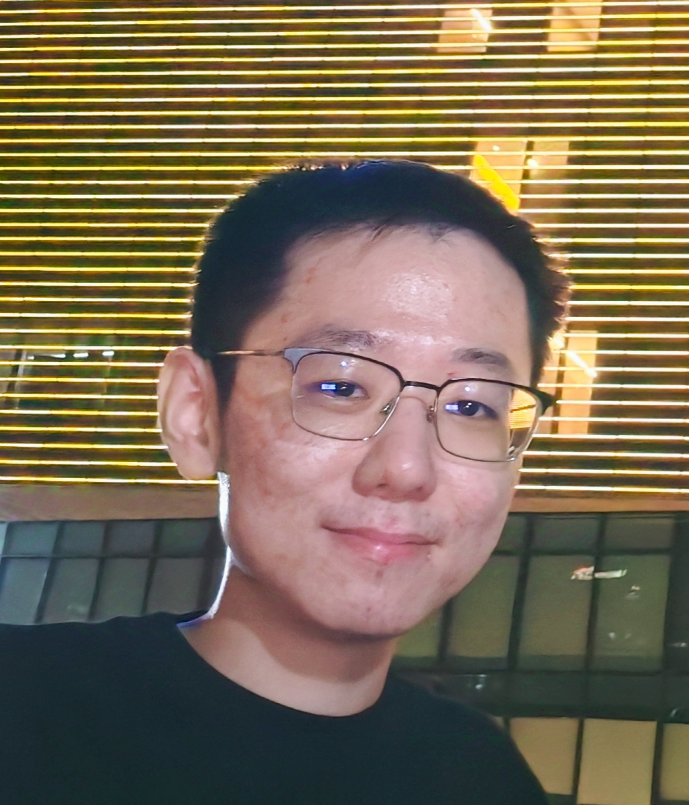

# About Me

 

Hi, I'm Shuqing Luo. I'm an incoming CS PhD student in the UNITES lab at the University of North Carolina, Chapel Hill, working with [Prof. Tianlong Chen](https://tianlong-chen.github.io/). I'm interested in efficient and distributed training and inference of large language models using algorithm-system co-design, such as structural & unstructural sparsity and advanced model parallelism.

 

## Experience

 

- **Feb 2025 - today:** Scaling team of Moonshot AI, Research Intern
- **Sep 2023 - today:** School of Electronic and Computer Engineering, Peking University, MPhil
- **Sep 2019 - June 2023:** School of Cyber Science and Engineering, Shanghai Jiao Tong University, B.Eng

 

<!-- --- -->

## Awards

 

- **Nov 2020:** Merit Student Award (SJTU, 5%)
- **Nov 2021:** Shaoqiu Scholarship (SJTU, 1%)
- **Dec.2021:** Undergraduate Class B Scholarship (SJTU, 10%) 
- **June 2023:** Outstanding graduate

 

<!-- --- -->

